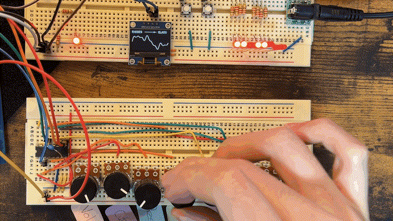

# STM32 Polyphonic Wavetable Synthesizer

A bare-metal, 8-voice polyphonic wavetable synthesizer built on the STM32F407G-DISC1. Receives MIDI over USB, processes audio in real-time on the Cortex-M4 FPU, and outputs to the on-board CS43L22 DAC, with all timing interrupt-driven.

**[Demo Video](https://youtu.be/QuVIntSHrEU)** | **[Case Study](https://www.kenmusic.net/projects/stm32-synth)**

[](https://github.com/kencul/STM32F4-AudioSynthesis/actions/workflows/tests.yml)



---

## Features

- **8-voice polyphony** with priority-based voice stealing (idle → released → oldest)
- **Dual-slot wavetable morphing** — crossfade between two waveforms in real time
- **Zero-Delay Feedback State Variable Filter** — algebraic loop solver for analog-accurate resonance
- **Per-voice ADSR** with soft-kill ramp (~5ms) to eliminate clicks on voice steal
- **USB MIDI device** — plug-and-play with any DAW or controller (Note On/Off, Pitch Bend, Mod Wheel, Panic)
- **8 hardware knobs** via ADC + multiplexer: Volume, Cutoff, Resonance, Morph, Attack, Decay, Sustain, Release
- **SSD1306 OLED** with context-sensitive views (waveform preview, filter curve, ADSR shape)
- **PCA9685 LED controller** displaying per-voice amplitude in real time
- **CCMRAM placement** for `VoiceManager` to eliminate bus contention on the audio path
- **DWT cycle counter** for measuring audio block processing time in µs

---

## Architecture

```
USB OTG ──► MIDI Parser
                │
                ▼
          VoiceManager  (CCMRAM)
          ┌─────┴──────────────────────────────┐
       Voice 0  ···  Voice 3  ···  Voice 7     │
          │              │              │       │
        [Osc]          [Osc]          [Osc]    │  ← Wavetable phase accumulator
     (Morph A↔B)   (Morph A↔B)   (Morph A↔B) │     + pitch bend (2^x formula)
          │              │              │       │
        [SVF]          [SVF]          [SVF]    │  ← Zero-delay feedback
          │              │              │       │
       [ADSR]         [ADSR]         [ADSR]    │  ← Soft-kill on voice steal
          └─────┬──────────────────────────────┘
                │  sum ÷ 8 (normalized mix)
                ▼
         DMA Circular Buffer  (128 samples × int16, stereo)
                │
                ▼  Half-transfer / transfer-complete IRQ fills each half
            I2S3 (DMA, 48 kHz, 16-bit)
                │
                ▼
          CS43L22 Codec  (initialized via I2C)
                │
                ▼
        3.5 mm Headphone Jack


Hardware Control (main loop, polled)
  TIM4 IRQ ──► ADC DMA ──► PotBank (8 knobs via analog mux)
  GPIO IRQ ──► Button debounce (25 ms) ──► waveform cycle

UI (main loop)
  OLED SSD1306 (I2C) — wavetable / filter / ADSR view, 1.2 s timeout
  PCA9685 (I2C)      — 8 voice-level LEDs, updated every 20 ms
```

---

## Project Structure

All original code is in `App/` and `tests/`. Everything else is ST-generated or vendored.

| Directory | Contents |
|-----------|----------|
| `App/` | **Original** — DSP engine, synthesis, MIDI handling, UI |
| `tests/` | **Original** — host-side test suite |
| `Core/` | CubeMX-generated: HAL init, clock config, interrupt handlers |
| `Drivers/` | Vendored: CMSIS and STM32F4xx HAL |
| `Middlewares/` | Vendored: STM32 USB Device Library; `usbd_audio.c` modified to route USB packets into `App/`'s MIDI parser |
| `USB_DEVICE/` | CubeMX-generated: USB descriptor config |

---

## Build Environment

| Tool | Version |
|------|---------|
| arm-none-eabi-gcc | 14.3.1 (GNU Tools for STM32 14.3.1+st.2) |
| CMake | ≥ 3.22 |
| C standard | C11 |
| C++ standard | C++17 |
| STM32CubeMX | Used to generate HAL init code (`.ioc` included) |

The toolchain file targets **Cortex-M4** with the **FPV4-SP-D16** FPU (`-mfloat-abi=hard`). Floating-point synthesis runs natively on hardware without software emulation.

---

## Dependencies

All dependencies are vendored in the repository.

| Dependency | Location | Notes |
|------------|----------|-------|
| CMSIS 5 | `Drivers/CMSIS/` | Core headers for Cortex-M4 |
| STM32F4xx HAL | `Drivers/STM32F4xx_HAL_Driver/` | ST HAL for F4 series |
| STM32 USB Device Library | `Middlewares/ST/STM32_USB_Device_Library/` | USB Audio class (repurposed as MIDI) |

---

## Building

```bash
# Configure (Debug)
cmake -B build/Debug \
  -DCMAKE_TOOLCHAIN_FILE=cmake/gcc-arm-none-eabi.cmake \
  -DCMAKE_BUILD_TYPE=Debug

# Build
cmake --build build/Debug
```

Flash and debug using the [STM32 VS Code Extension](https://marketplace.visualstudio.com/items?itemName=stmicroelectronics.stm32-vscode-extension) (ST's official extension). The `.vscode/launch.json` is pre-configured with an ST-Link GDB server launch target. Press **F5** or use the Run and Debug panel to build, flash, and attach in one step.

---

## Knob Mapping

| Control | Parameter | Scale |
|---------|-----------|-------|
| Volume | Master volume | Exponential |
| Cutoff | Filter cutoff frequency | Exponential, 20 Hz – 20 kHz |
| Resonance | Filter resonance | Power curve (deadzone at heel) |
| Morph | Wavetable crossfade | Linear, A → B |
| Attack | Envelope attack time | Exponential, 0 – 2 s |
| Decay | Envelope decay time | Exponential, 0 – 2 s |
| Sustain | Envelope sustain level | Linear, 0 – 1 |
| Release | Envelope release time | Exponential, 0 – 2 s |

---

## Tests

A host-side test suite in `tests/` verifies filter math on desktop before deploying to hardware with no flash cycle required.

| Test | What it checks |
|------|---------------|
| SVF -3 dB at cutoff | With Butterworth Q, steady-state RMS ratio at cutoff vs. passband is 0.707 ± 10% |
| SVF self-oscillation stability | Impulse at max resonance (k clamped to 0.01) stays bounded over 10 000 samples |
| MoogLadder bounded near resonance | Impulse at res = 0.95 stays finite and bounded over 5 000 samples |
| MoogLadder DC stability | Constant input at res = 0 converges without drift or oscillation |
| ADSR attack time accuracy | gate(true) reaches 1.0 within ±10% of the configured attack time |
| ADSR kill ramp completes in ~5 ms | kill() reaches silence and IDLE within 300 samples (240 = 5 ms at 48 kHz), contract for click-free voice stealing |
| ADSR release converges to zero | The −0.01 offset in the release formula forces the exponential to reach exactly 0.0 and transition to IDLE |

```bash
# Configure (native compiler, no ARM toolchain needed)
cmake -B tests/build -S tests

# Build
cmake --build tests/build --config Release

# Run
ctest --test-dir tests/build -C Release -V
```

---

## Performance

Measured with the DWT cycle counter (`DWT->CYCCNT`) at 168 MHz, 64-sample buffer (1.333 ms window):

| Condition | Audio callback time | CPU usage |
|-----------|-------------------|-----------|
| 0 voices active | 20 µs | 1.5% |
| 8 voices active | 347 µs | 26% |

74% of the compute budget remains headroom at full polyphony.

---

## Challenges

### Filter Selection
The initial Moog ladder implementation produced audible glitching even after reducing oversampling from 4x to 2x and replacing per-stage tanh saturation with a single approximation. Rather than continue degrading the algorithm, I switched to the ZDF SVF, which ran cleanly at 8 voices. After the project was complete, I benchmarked both using the DWT cycle counter: the compromised Moog ladder cost 838 µs at 8 voices (62.9% of the 1.333 ms audio budget) with no headroom left for oscillators or envelopes. A correct implementation would cost roughly 4x more. The full 8-voice SVF engine measured at 347 µs.

### Zero-Delay Feedback Algebraic Loop
Standard SVF implementations insert a one-sample delay in the feedback path for a simpler update equation. At high cutoff frequencies this causes measurable phase drift. The ZDF topology resolves the implicit feedback equation analytically each sample: precomputing `den = 1 / (1 + g*(g+k))` derives three coefficients that give exact output with no delay. Adapted from filter design theory in my MSc Sound Computing program and targeted to the Cortex-M4 FPU constraints.

### Click-Free Voice Stealing
Hard-resetting an active voice on note steal causes an audible click from the amplitude discontinuity. The fix is a dedicated KILL envelope state: `Adsr::kill()` calculates a linear ramp step to reach silence in ~5 ms (240 samples at 48 kHz). The incoming note is stored in a `_pending` struct and fires only after KILL transitions to IDLE. A secondary issue: exponential release asymptotes toward zero but never reaches it. Offsetting by -0.01f before the multiply shifts the convergence target below zero, forcing the output to snap to exactly 0.0.

---

## Code Highlights

- **[App/Inc/svf.h](App/Inc/svf.h)**: `process()` implements the ZDF algebraic loop. The `fast_tanh` Pade approximation adds analog saturation on the first integrator state without the cost of `std::tanh`. Coefficient derivation is in `updateCoefficients()` in [App/Src/svf.cpp](App/Src/svf.cpp).

- **[App/Inc/adsr.h](App/Inc/adsr.h)**: `getNextSample()` contains the full six-state envelope machine. The KILL branch and the -0.01f offset in RELEASE are the two non-obvious pieces; the offset is the exact-zero convergence contract the test suite verifies.

---

## Dev Notes

[DEVLOG.md](DEVLOG.md) documents the full development process: hardware bring-up (I2C/I2S/DMA, codec initialization), performance profiling methodology, and the reasoning behind key architectural decisions like CCMRAM placement, the ZDF filter topology, and the soft-kill voice stealing design.

---

## License

MIT: [LICENSE](LICENSE).
